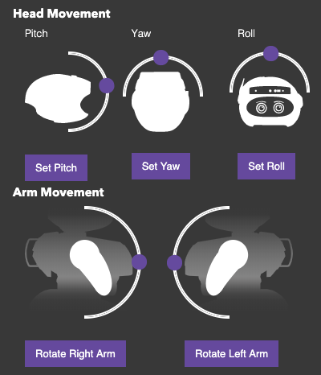
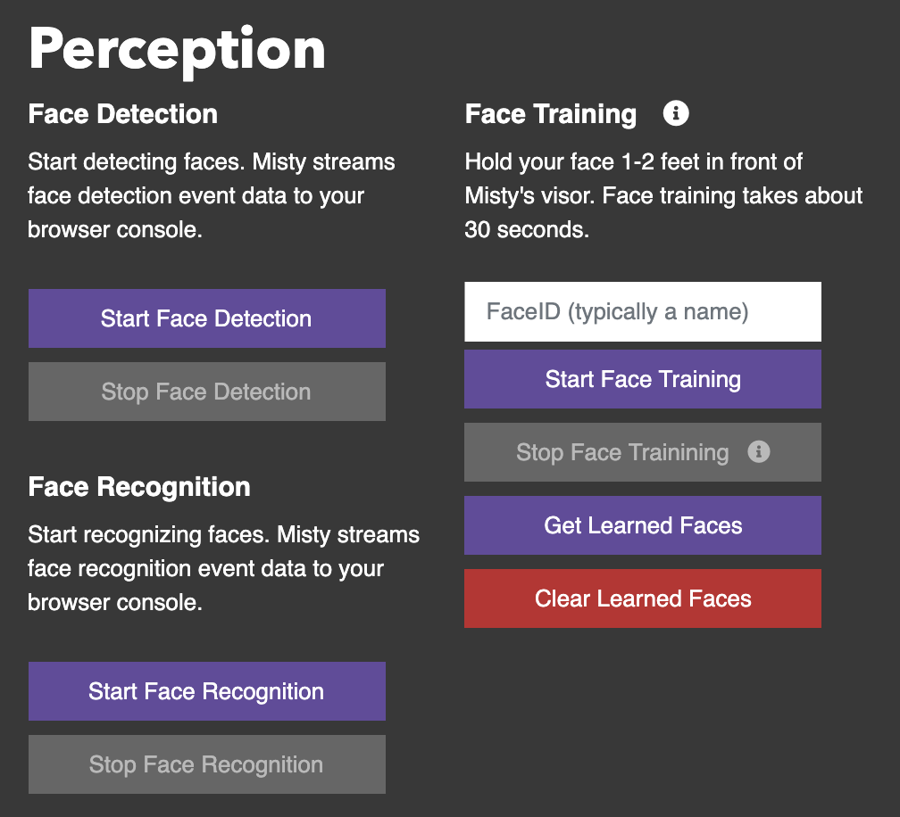
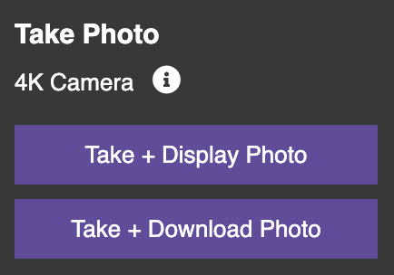
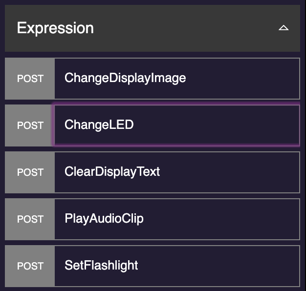

# {{title}}

Welcome to the Misty II Getting Started guide! This document provides a set of activities to familiarize developers with Misty II, her SDK, and her web-based developer tools.

Follow this guide to learn:

* how to use Misty's [Command Center](http://sdk.mistyrobotics.com/command-center) to discover your robot's capabilities and send basic commands before writing your own code
* how to use Misty's [API Explorer](http://sdk.mistyrobotics.com/api-explorer) to interact with Misty's REST API and generate sample code for your skills and robot applications
* how to install and run your own skills on Misty II
* how to set up the Misty Skills Extension for Visual Studio Code to deploy skills without leaving your text editor

**Before you begin**, you need:
* a Misty II robot that's powered on and connected to your local Wi-Fi network.
* the IP address for your Misty II robot, which you can find in the Misty App.

{{box op="start" cssClass="boxed noteBox"}}
**Note:** If you have not yet connected your Misty II robot to your Wi-Fi network, you can do so now by using the Misty App for iOS or Android. For more information, see the instructions in the [Misty App section of this documentation](../../../tools-&-apps/mobile/misty-app).
{{box op="end"}}

## Sending Basic Commands

The [Command Center](http://sdk.mistyrobotics.com/command-center/index.html) is a graphic interface for sending commands to Misty without writing any code. Follow the steps in this section of the Getting Started guide to familiarize yourself with the different elements of the Command Center.

{{box op="start" cssClass="boxed noteBox"}}
**Note:** We recommend using the Command Center with the latest version of the Google Chrome browser.
{{box op="end"}}

Follow these steps to start using the Command Center:

1. [Open up the Command Center](http://sdk.mistyrobotics.com/command-center) in a browser window.
2. Enter your robot's IP address in the upper-right hand corner of the page and click the **Connect** button. (You can find your robot's IP address in the Misty App.) Look for a "Connected successfully" message to appear at the bottom of the browser window.

Once Misty is connected, you can experiment with Misty's functionality by interacting with different elements of the Command Center. Here are a few things to try:

* Use the **Quick Commands** section to change the color of Misty's chest LED, show a different image on her display, and have her play a sound. 
  * Use the color picker or type in different RGB values and click the **Change LED** button. For example, if you wanted Misty's LED to be purple, use **Red**: `101`; **Green**: `73`; and **Blue**: `157`.
  * Change Misty's eyes by choosing a different file from the **Change Display Image** menu. For example, try changing her eyes to `Sad.png` or `Angry.png`.
  * Play a sound by choosing a file from the **Play Audio File** menu.
* Use the **Movement** section to move Misty's head and arms. 
  * Move Misty's head by moving the sliders under **Head Movement**. Set a new **Pitch**, **Yaw**, or **Roll** position, and then click the **Set** button.
  * Move Misty's arms by moving the left or right slider and clicking the **Rotate Left Arm** or **Rotate Right Arm** button.
* Use the **Perception** section to train Misty to recognize your face. 
  1. To make sure Misty's head is positioned for effective face training, use the **Pitch**, **Yaw** and **Roll** commands under the **Movement** section to align Misty’s gaze with yours. Then, in the **Perception** section, go to **Face Training** and type your name in the **Name to Train** field. Make sure to enter a single word without spaces.
  2. Click the **Start Face Training** button. Wait 10-15 seconds for face training to complete. The main Command Center window displays pop-up status messages during the face training process.
  3. When face training is complete, you can click the **Get Learned Faces** button to see the labels for people Misty can recognize. Check for your name to make sure Misty learned your face!
* Use Misty's camera to take a picture. 
  * Use the head movement controls to point Misty's visor at something you'd like to photograph. In the **4K Camera** section, click the **Take + Display Photo** button to see what Misty’s sees.

## Exploring Misty's API

You can use Misty's [API Explorer](http://sdk.mistyrobotics.com/api-explorer) to browse Misty's list of REST API endpoints, send requests to Misty, experiment with different parameters, and generate code samples for Misty's REST API and on-robot JavaScript API. This section of the Getting Started guide teaches how to start using the API Explorer to send commands directly to your robot.

Follow these steps to start learning about the API Explorer:

1. Follow the link at the top of the Command Center to open up the [API Explorer](http://sdk.mistyrobotics.com/api-explorer) web page. If Misty is still connected to the Command Center when you do this, this connection carries over to the API Explorer, and there's no need to reconnect. If not, you'll need to use Misty's IP address to connect your robot to the API Explorer.
2. Start by changing the color of Misty's chest LED. Open the **Expression** group in the left-hand side of the page and select the **ChangeLED** command. 
3. Under the **Parameters** section, add a value between `0` and `255` in the **Red**, **Green**, and **Blue** fields. For example, if you want her LED to be fuschia, use **Red**: `204`, **Green**: `0`, **Blue**: `204`. 
4. Click **Send Request** to send the command and change the LED.
5. Next let’s play an audio clip on Misty. Select the **Expression** group from the list on the left-hand side of the page, and click on the **PlayAudioClip** command. 
6. Enter the file name for one of Misty's default system audio files into the **FileName** field. Try using `034-Hicup.wav`,
`013-0Bark.wav`, or `001-Veep.wav`. Set the volume to a number between `10` and `100`, and then click **Send Request**. 
1. Lastly, let’s change Misty's eyes. Select the **ChangeDisplayImage** command from the list of commands. Enter `Relaxed.png`, `Afraid.png`, or `Waking.jpg` into the **FileName** field, and click **Send Request**.

## Uploading Skills with Skill Runner

The [Skill Runner](http://sdk.mistyrobotics.com/skill-runner/index.html) web page allows you to install, run, and manage skills on Misty. This section of the Misty II Getting Started guide teaches how to use the Skill Runner to deploy the sample `lookAround` skill to Misty.

You can download the files for the `lookAround` skill from the [`lookAround` repository in the MistySampleSkills GitHub organization](https://github.com/MistySampleSkills/lookAround). This repository includes:
* `lookAround.js`, which contains the JavaScript that Misty executes when she runs the skill
* `lookAround.json`, which contains a JSON object with metadata and and parameters required to run a skill

After you've downloaded these files, follow these steps to install and run the `lookAround` skill on your Misty II:

1. Follow the link at the top of the API Explorer to open up the [Skill Runner](http://sdk.mistyrobotics.com/skill-runner) web page. If Misty is still connected to the API Explorer when you do this, this connection carries over to the Skill Runner, and there's no need to reconnect. If not, you'll need to use Misty's IP address to connect your robot to the Skill Runner.
2. Open your browser's web console to view debug messages, error messages, and other data Misty sends to the Skill Runner web page. To open the web console in Chrome, use **Ctrl + Shift + J** (Windows/Linux) **Cmd + Option + J** (Mac).
3. Under the **Install** section of the Skill Runner, click **Choose a file**. Navigate to the folder where you downloaded the `lookAround.json` and `lookAround.json` files. Select **both files** and then click **Open**.
4. When the skill uploads, it appears in the **Manage** section of the Skill Runner page. Find the **lookAround** skill and click **Start** to run it!

You can also experiment by downloading and installing other [sample skills from GitHub](https://github.com/MistySampleSkills).

## Setting Up the Misty Skills Extension for Visual Studio Code

In addition to deploying skills from the the Skill Runner web page, you can also deploy skills to Misty directly from the Visual Studio Code editor. You can [download Visual Studio Code for free from Microsoft](https://code.visualstudio.com/). Follow [these instructions](https://docs.mistyrobotics.com/tools-&-apps/plugins-&-extensions/misty-skills-extension/) to install the Misty Skills Extension for VSC.

## What's Next?

Now that you've spent some time with Misty and her tools, you're ready to write your first robot skill. We suggest working through Misty's [Hello World Tutorial Series](../../../misty-ii/robot/hello-world) next!

## Getting Support

If you get stuck or have questions while developing for and interacting with your Misty II robot, there are several ways to get help.

* For **questions about coding Misty**, post in the Community Forums first. This gives other developers – in addition to all of the Misty staff – the ability to jump in and help. The [Support](https://community.mistyrobotics.com/c/support), [Feature Requests](https://community.mistyrobotics.com/c/feature-requests), and [Bug](https://community.mistyrobotics.com/c/bugs) categories (in particular) are monitored for immediate response from 9am-6pm Mountain Time on weekdays and from 9am-4pm Mountain Time on weekends.
* For **product support** – for example, for shipping questions, or issues with Misty's general functionality – email us at support@mistyrobotics.com. Our email support hours are 9 AM to 5 PM MST Monday through Friday.

Also – and this is **just for field trial testers** (AKA members with a **Launch Crew** badge on the Misty Community forums) – you should have received an invitation to join the [Misty Community Slack](http://misty-community.slack.com/). Use Slack to request real-time support and have conversations with other Misty users and employees. Slack support hours are 9 AM to 6 PM MST Monday through Friday, and 9 AM to 4 PM MST Saturday and Sunday.

## Additional Resources

You can find helper libraries, code samples, wrappers, and other useful tools for skill development in the [Misty Robotics Community](https://github.com/MistyCommunity) on GitHub. For examples of working skills that use a variety of Misty's capabilities, see [Misty Skill Samples](https://github.com/MistySampleSkills/) on GitHub.
